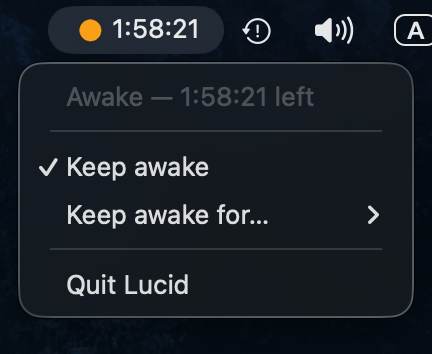

# Lucid

[](LICENSE)


**Keep your Mac awake — straight from the menu bar.**

Lucid is a tiny macOS menu-bar app that stops your Mac from going to sleep — handy
when you're presenting, downloading, compiling, or just reading and don't want the
screen to dim. Click once to stay awake until you turn it off, or pick a timer
(30 minutes, 1, 2, or 5 hours) and it switches itself off. While it's active the
menu-bar icon glows and shows a live countdown — no dock icon, no window, no fuss.

> ⚠️ **Status:** v0.1, early but working. macOS only.



<sub><i>Awake with a 2-hour timer running — the menu-bar icon glows amber and counts down beside it; click to toggle, or pick a timer.</i></sub>

## Why it's tiny and trustworthy

Lucid doesn't reinvent power management — it drives the **`caffeinate`** utility
that already ships with macOS (`caffeinate -d -i`, preventing display and idle
sleep). It simply spawns and stops that process for you, with a friendlier face:

- **No background daemon, no login item, no kernel extensions** — just one
  short-lived child process that exists only while you're keeping awake.
- **Idle CPU ≈ 0** — there's nothing running until you flip it on.
- **The whole UI is the native menu** — no web view is ever shown.

## Features

- **Toggle** keep-awake on/off from the menu bar
- **Timers** — keep awake for 30 min / 1 h / 2 h / 5 h, then it switches off automatically
- **Status at a glance** — the menu-bar icon and menu text show whether you're awake or sleeping
- **Stays out of the way** — menu-bar only, no dock icon, no window
- **Cleans up after itself** — quitting Lucid ends the keep-awake immediately

## Install / run from source

Prerequisites: [Node.js](https://nodejs.org) 18+ and the
[Rust toolchain](https://www.rust-lang.org/tools/install)
([Tauri prerequisites](https://tauri.app/start/prerequisites/)).

```bash
git clone https://github.com/growthforging/lucid.git
cd lucid
npm install

# run in development
npm run tauri dev

# build a distributable .app
npm run tauri build
```

When it launches, look for the icon in your **menu bar** (top-right) — there's no
dock icon or window by design.

## Tech

- [Tauri v2](https://tauri.app) — native tray + tiny footprint (Rust)
- macOS [`caffeinate`](x-man-page://caffeinate) — the actual sleep prevention
- The logic lives in [`src-tauri/src/lib.rs`](src-tauri/src/lib.rs)

## License

[MIT](LICENSE)
